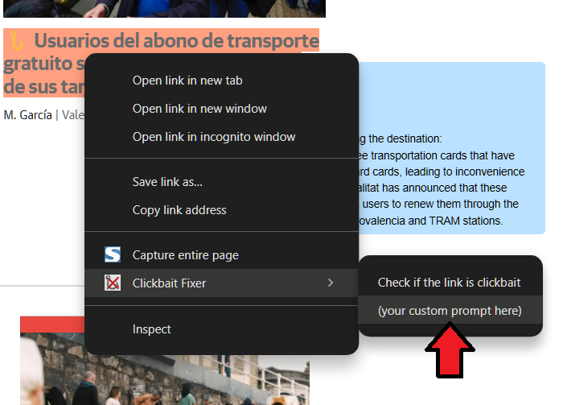
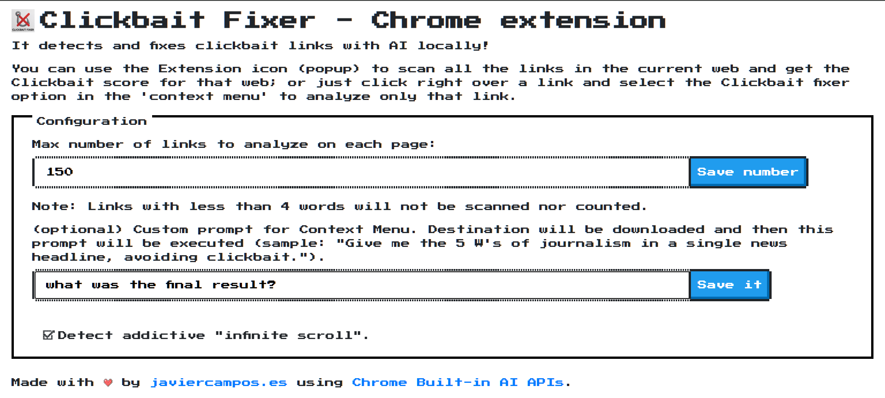

# clickbait-fixer-chrome-extension

The Chrome Extension that detects and fixes clickbait links in any website with AI locally!

## 💡 Inspiration

Clickbait is everywhere online these days. It's those over-the-top or misleading headlines that make you want to click, but the content rarely lives up to the hype. Sure, it can get tons of views, but it’s super frustrating because it wastes your time and sometimes spreads misinformation. Plus, it makes people trust online content less and less. It's something we need to call out and avoid if we want the internet to be a better, more honest space.

Could a Large Language Model (LLM) detect from a headline whether it is clickbait or not? And if it can do so, could it be run locally to 1) have minimal latency that does not affect our speed while reading news; 2) not involve additional costs for the user; 3) not impact privacy?

## ✨ What it does

"Clickbait Fixer" is a Chrome Extension that detects and fixes clickbait links in any website with AI locally! You can choose between a specific link (right click on it to detect clickbait and fix it); or analyze an entire website in 1 click to get the "Clickbait score" of that website. Built with Chrome Built-in AI: Prompt API and Summarization API.

### Key features

1. Scans the links of any website, and **marks the clickbaits in red and the headlines that are not clickbait in green**. To do this, it uses a local AI API (**Prompt API**).
2. Based on the number of clickbaits on the website, it generates a **clickbait score for that website**. The score will be a value between 0 (all links are clickbaits) and 100 (no clickbaits).
3. It adds an **awesome tooltip to each link**, with the following information: **why it is or is not clickbait; and a non-clickbait alternative headline suggestion**.
4. You read that right! The non-clickbait alternative title suggestion is generated by automatically **downloading the link destination and summarizing it locally** (**Summarization API**).
5. You can use the **Extension icon (popup)** to scan all the links in the current web; **or just click right over a link** and select the Clickbait fixer option in the **context menu** to analyze only that link.

## 🏗️ How we built it

This Chrome extension uses Built-in AI APIs to detect whether any link is clickbait or not (PromptAPI) and suggests non-clickbait links by downloading the link destination and summarizing it (SummarizationAPI).

To easily indicate whether a link is clickbait or not, content is injected into the page to mark each headline in red or green; and a tooltip is also injected when customer hovers those links.

As for the Chrome Extension, it is worth noting that: it has a popup from which you can perform an analysis of an entire web page and obtain its "Clickbait score" (from 0 to 100; 100 is the best). From the popup you can also see if your web browser is compatible or if the AI ​​model is being downloaded. There is also a configuration section to indicate the maximum number of links that will be analyzed in full scans.

When a link is clickbait and the user hovers over it again, a tooltip is displayed with the explanation and an alternative non-clickbait headline. To generate this alternative title, the link destination is first fetched with Ajax, its content is filtered (ie: prioritize "p" tags) and summarized with SummarizationAPI.

Last but not least, the Chrome Extension has a ContextMenu to analyze any specific link (right click on any link) without full scan required.

This Chrome Extension uses messages for communicating between components: sending messages from Content to Popup; and messages from Background to Content.

### ⚙️ Prerequisites and chrome extension instalation

This project uses experimental Chrome APIs to leverage **AI locally**. You have to enable these features in your Chrome browser before using this Chrome extension:

1. Open a new tab in Chrome, go to `chrome://flags/#optimization-guide-on-device-model`. Select there `Enabled BypassPerfRequirement`.
2. For **Prompt API** `chrome://flags/#prompt-api-for-gemini-nano` (Prompt API is available, behind an experimental flag, from Chrome 127+ on **desktop** platforms). Select there `Enabled`.
3. For **Summarization API**  `chrome://flags/#summarization-api-for-gemini-nano` (Summarization API is available behind an experimental flag, from Chrome 129+ on **desktop** platforms). Select there `Enabled`.
4. To build this chrome extension, follow these steps (because now it uses [Chrome Extension CLI](https://github.com/dutiyesh/chrome-extension-cli)):

4.1. (in you didn't install chrome-extension-cli yet use this command line) `npm install -g chrome-extension-cli`

4.2. `cd clickbait-fixer-chrome-extension/clickbait-fixer-chrome-extension`

4.3. `npm run watch`

4.4. And then open this in Chrome: `chrome://extensions/`, check the `developer mode` and use the button called `load unpacked` to select the folder `clickbait-fixer-chrome-extension/build`.

## 🤯 Challenges we ran into

* To get the suggested non-clickbait headline, my first attempt was to also use "PromptAPI", but I eventually discarded it and got good results with "SummarizationAPI".

* Prompt API works well in the role of identifying whether a headline is clickbait or not, even with a simple prompt. But I wanted the PromptAPI output to be directly in JSON format and that made development a bit longer. As a lesson learned, I think I would have stopped sooner by asking PrompAPI for a simpler output format (ie: "isClickbait (separator) explanation").

* Detecting all the links on any website that are eligible for analysis was also a challenge. Detecting these links is done using filters in the DOM of the page.

* Debugging Chrome Extension was a bit of a challenge too, compared to regular web debugging, since the web dev console and the extension dev console (ie: extension popup) are 2 different consoles.

## 🙌 Accomplishments that we're proud of

I'm very proud of the purpose and UX of this Chrome extension. It's solving a real problem and doing it in a user-friendly way, without limiting how the user usually navigates news pages, but empowering the user with the red/green highlighting of clickbai/non-clickbait headlines and with the useful tooltip in each link.

The user can do a full scan of a page to get the score of the page and know if it's a media that promotes clickbait or not. But users can also navigate without scanning a page and simply use the right click to analyze specific links. This solution is very non-intrusive and very easy to learn.

## 🧑‍🎓 What we learned

I learned a lot about:
* Built-in AI in Chrome (specifically about the APIs I used and the others; how to manage errors and how to download the model if they are not downloaded), 
* Chrome Extensions (ie: sending messages from Content to Popup; and messages from Background to Content; Context Menu; etc).
* Prompting, since I iterated the prompt to get if a given link is clickbait or not.
* Filters in the DOM to find links; 
* Sanitizing the Prompt API response to convert it to JSON.

## 🔜 What's next for Clickbait Fixer

* Multilingual UI to reach more users. I've found that Built AI APIs work well with multiple languages, so this next step would focus on translating the UI only.
* Sometimes the non-clickbait headline suggested by AI is very long, even if I use the "headline" and "short" parameters. As next steps I want to try more parameter combinations or even use PromptAPI with the output of SummarizationAPI.

## Instructions

1. Go to any online newspaper (ie: https://apnews.com/ (English) or https://lasprovincias.es (Spanish)).
2. Hover over any link in the newspaper, right-click and choose the option "Check if the link is clickbait".
3. The link text will instantly be marked red or green (clickbait or not; classification made with Prompt API locally).
4. Hover over the link again to see the tooltip.
5. If the link was marked as clickbait, then in the tooltip you will also see a suggestion for a non-clickbait headline (headline obtained by downloading the target page and summarizing it with Summatization API).
6. Also use the Chrome Extension button (in the browser bar), to 1) do a full scan of the page and get its "clickbait score"; 2) access the extension settings.

## 🔗 Other resources

- https://github.com/WICG/writing-assistance-apis
- https://developer.chrome.com/docs/extensions
- https://googlechromeai.devpost.com/
- https://developer.chrome.com/docs/ai/summarizer-api
- https://developer.chrome.com/docs/extensions/develop/concepts/messaging

## 🖼️ Screenshots

Now this Chrome Extension includes "infinite scroll" detection to help you to break out of the loop:

